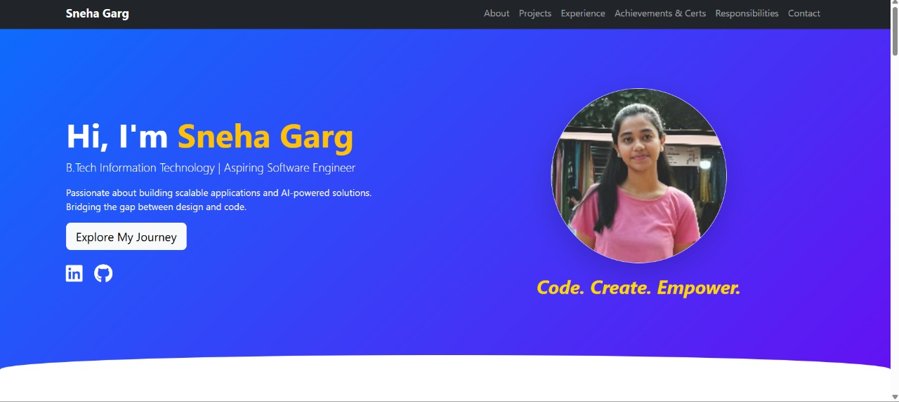
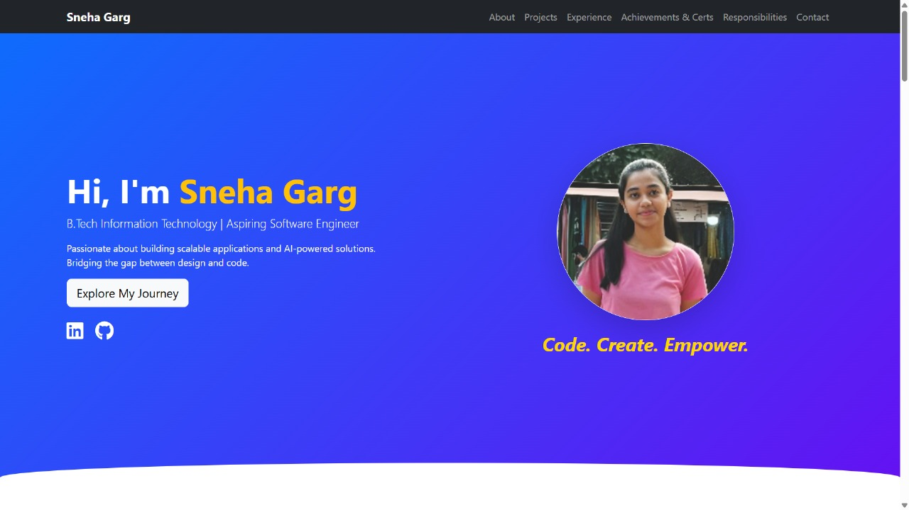
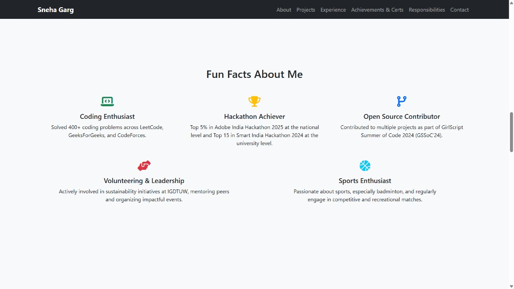

# Sneha Garg - Personal Portfolio  
*B.Tech IT | Aspiring Software Engineer | Web Development & Machine Learning*

---

## 🚀 Live Portfolio
**[https://sneha-garg-portfolio.netlify.app](https://sneha-garg-portfolio.netlify.app)**

---

## 📌 About
This is my personal portfolio website showcasing my projects, achievements, experience, and professional journey.  
It is designed to be fully responsive and professional, providing recruiters and visitors with a quick overview of my skills and work.

---

## 🛠 Tech Stack

---

## ✨ Features
- Fully responsive design, works on all devices
- Professional dark & light section contrast
- Project cards with GitHub and live demo links
- Fun Facts section for personal touch
- Auto-deploy from GitHub via Netlify

---

## 📂 Sections Included
- **Hero Section** – Introduction & headline
- **About Me** – Background, skills, highlights
- **Fun Facts** – Personal and professional highlights
- **Projects** – Major work with GitHub links
- **Experience** – Internships and work experience
- **Achievements & Certifications**
- **Positions of Responsibility**
- **Stats Section** – Quick journey in numbers
- **Contact Me** – Email, LinkedIn, GitHub links

---

## 🚀 Deployment
This portfolio is deployed on **Netlify** with **auto-deploy** from GitHub.  
Whenever I push changes to this repository, the live site updates automatically.

---

## 📸 Screenshots

<!-- Full Portfolio -->

<!-- Fun Facts Section -->

---

## 📬 Contact
- **Email:** [snehagarg899@gmail.com](mailto:snehagarg899@gmail.com)
- **LinkedIn:** [linkedin.com/in/sneha-garg-3915ba28a](https://www.linkedin.com/in/sneha-garg-3915ba28a/)
- **GitHub:** [github.com/Snehagg88](https://github.com/Snehagg88)
